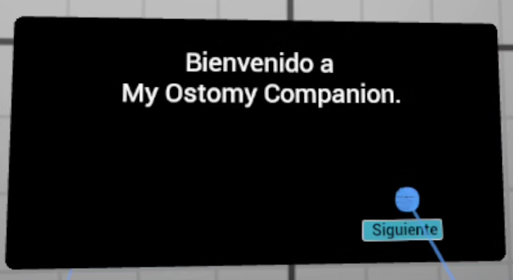
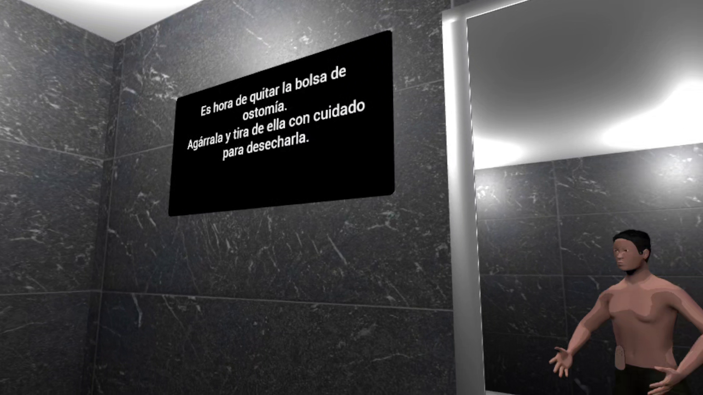
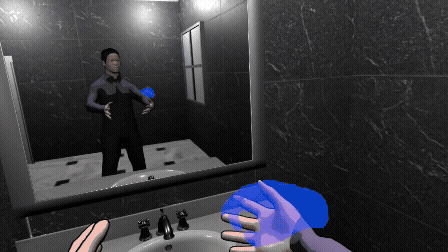
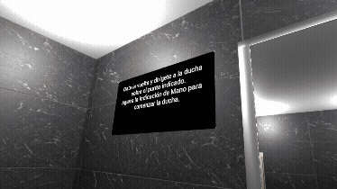

# My Ostomy Companion

**Virtual Reality experience for ostomy patients**

[](https://www.unrealengine.com/)
[](https://www.khronos.org/openxr/)
[](https://www.meta.com/quest/quest-2/)

> **My Ostomy Companion** is an immersive Virtual Reality prototype designed to support adult ostomy patients during the process of adapting to their new body image and becoming familiar with ostomy pouch care.



## About the project

*My Ostomy Companion* is a **psychoeducational serious game / immersive VR experience** developed as an individual Master's thesis project for the **Master's Degree in Video Game Design and Development at Universidad Internacional de La Rioja (UNIR)**.

The project explores how Virtual Reality can provide a safe and controlled environment where an ostomy patient can progressively become familiar with their new body image, their stoma and the basic actions involved in ostomy pouch care.

Rather than replacing healthcare professionals, the prototype is conceived as a **potential complementary tool** that could accompany the patient during their recovery and adaptation process.

## Experience

The player takes the role of an ostomy patient returning home at the end of the day and preparing to take a shower.

The experience follows a guided sequence:

1. **VR tutorial**

   * Learn basic movement.
   * Learn how to rotate.
   * Interact with objects.
   * Become familiar with the VR controls.

2. **Bathroom**

   * Enter the virtual bathroom.
   * Explore the player's body.
   * Observe the avatar through the mirror.
   * Remove the shirt.
   * Locate and remove the ostomy pouch.

3. **Shower**

   * Interact with the shower.
   * Transition to the post-shower state through a VR-compatible fade-to-black system.

4. **New pouch**

   * Follow the instructions to attach a new ostomy pouch.
   * Complete the guided experience.

The interaction is designed around actions that resemble real-world behaviour, such as grabbing and releasing objects, manipulating clothing and handling the ostomy pouch.

## Demo video
[](Documentation/Media/Demo_final.mp4)

## Key features

* 🥽 **Immersive Virtual Reality**
* 🧍 **Player avatar**
* 🪞 **Interactive simulated mirror**
* 🤲 **Hand-based object interaction**
* 👕 **Removable clothing**
* 🩹 **Interactive ostomy pouch**
* 🧼 **Guided pouch removal and hygiene sequence**
* 🚿 **Virtual shower interaction**
* 🎨 **Stylised cartoon visual direction**
* 🦾 **Inverse Kinematics for realistic arm movement**
* 💡 **Standalone VR optimisation**
* ⚡ **Application SpaceWarp**
* 🔄 **OpenXR-based VR implementation**

The stylised visual approach deliberately avoids an overly realistic representation of the human body, with the aim of reducing the emotional impact of the experience.

## Technology

| Technology                | Purpose                                    |
| ------------------------- | ------------------------------------------ |
| **Unreal Engine 5.7**     | Game engine and VR application             |
| **Blueprints**            | Gameplay programming and rapid prototyping |
| **OpenXR**                | Cross-platform VR framework                |
| **Blender 5.0**           | 3D modelling and retopology                |
| **Meta Quest 2**          | Standalone VR target platform              |
| **Vulkan**                | Graphics API on Android                    |
| **Forward Renderer**      | Standalone VR rendering                    |
| **Application SpaceWarp** | Performance optimisation                   |

Unreal Engine's VR template was used as the starting point for the project, extending it with custom gameplay systems, avatar logic, interactions and UI. Blender was used for modelling and retopology.



## Avatar and IK system

The player avatar is based on the `BP_XRPawn` provided by Unreal Engine's VR template.

A custom animation system was implemented to provide more natural arm movement. The player's VR controller positions are used as targets for an **Inverse Kinematics (IK)** system based on:

* Rigged humanoid skeleton.
* Unreal Engine `IKRig`.
* Left and right arm chains.
* `ABP_Avatar` Animation Blueprint.
* `FABRIK` nodes.

This allows the avatar's arms to follow the player's virtual hands while maintaining a coherent shoulder-to-wrist chain.

## Simulated mirror

The bathroom includes a virtual mirror that provides a visual representation of the player.

Instead of relying on a conventional real-time Scene Capture mirror for the standalone version, the environment uses a **simulated mirror space** with a duplicated version of the room. A second avatar reproduces the player's actions, allowing the player to observe their body and interact with elements such as the shirt and ostomy pouch.

This approach reduces the rendering cost associated with a traditional real-time mirror and was part of the optimisation strategy for standalone VR.



## Gameplay architecture

The project extends Unreal Engine's standard VR template with custom gameplay entities.

The main systems include:

```text
BP_XRPawn
    │
    ├── Player Avatar
    ├── VR Interaction
    ├── IK / FABRIK
    └── Ostomy-related components
          │
          ▼
Level Blueprint
    │
    ├── Gameplay flow
    ├── Tutorial progression
    ├── Instructions
    ├── Scene transitions
    └── Interaction state
          │
          ├── Interactive objects
          └── Instruction Manager
```

The `Level Blueprint` acts as the global coordinator of the gameplay flow, communicating with the player, interactable objects and instruction system.

## VR-compatible transitions

The experience uses fade-to-black transitions when moving between gameplay states.

The standard Unreal Engine camera fade was not compatible with the final VR/OpenXR camera configuration. The final implementation therefore uses a **3D hemispherical mesh placed around the player's head**, with a material controlled through a scalar parameter.

The transition is managed through the `Level Blueprint` using:

* `DoFadeToBlack`
* `DoFadeFromBlack`
* `MaterialParameterCollection`
* `FadeValue`

This implementation works correctly in the final Android APK.

## Meta Quest 2 optimisation

Meta Quest 2 was used as the project's **technological baseline**, establishing the minimum hardware target for the prototype.

The final configuration uses:

* Android-based standalone VR.
* Qualcomm Snapdragon XR2.
* 6 GB RAM.
* OpenXR.
* Vulkan.
* Forward Renderer.
* Multi-view rendering.
* 6 DoF tracking.

The final packaged application occupies approximately **547 MB**.

### Performance optimisation

Several techniques were combined to achieve the required VR frame rate:

* **Static/precalculated lighting**
* **Duplicated environment for the simulated mirror**
* **Reduced render resolution**
* **Texture optimisation**
* **Application SpaceWarp**

The final render resolution was reduced to **80%**, from 1832×1920 to approximately 1465×1536 per eye. Application SpaceWarp then allowed the application to operate at approximately **36 rendered FPS / 72 FPS perceived output**, meeting the 72 FPS target used for the project.

Static lighting was also introduced to reduce the computational cost of the scene.

## Controls

The controls documented below correspond to Meta Quest 2 Touch controllers.

| Input                | Action                          |
| -------------------- | ------------------------------- |
| Left stick           | Select teleport destination     |
| Release left stick   | Teleport                        |
| Right stick          | Rotate                          |
| Left grip            | Grab / release object           |
| Right grip           | Grab / release object           |
| Left trigger         | UI interaction                  |
| Right trigger        | UI interaction                  |
| Left controller menu | Open options menu               |
| A button             | Show / hide interaction pointer |

The project uses OpenXR, allowing the interaction system to be adapted to other compatible VR platforms, although the tested standalone target is Meta Quest 2.

## Current status

**Prototype completed.**

The final project contains a functional introductory tutorial and a guided bathroom experience implementing the main interaction and gameplay systems proposed for the project.

The project should be considered a **research and development prototype**, rather than a finished commercial or medical application.

## Limitations

The current prototype has several known limitations:

* No clinical validation has been performed.
* No formal user study with ostomy patients has been conducted.
* No formal evaluation with healthcare professionals has been performed.
* The avatar customisation system is not included in the final prototype.
* The range of ostomy-care interactions is limited.
* The experience currently focuses on a single bathroom scenario.

These limitations are intentional in the context of the project's scope and timeframe.

## Future work

Possible future development includes:

### Avatar customisation

A character editor could allow users to create a more faithful representation of themselves, increasing personal identification with the virtual avatar.

### Expanded ostomy care

Additional interactions could cover more aspects of hygiene and ostomy pouch management.

### Additional environments

Future scenarios could introduce everyday situations where the player needs to become comfortable exposing their body after surgery, such as a swimming pool or beach.

### User testing and validation

A future study with ostomy patients could evaluate usability, emotional response and the potential usefulness of the experience as a complementary resource during recovery.

These extensions are identified in the original Master's thesis as future development opportunities.

## Academic context

This project was developed as an individual Master's thesis:

**Title:** *Acompañamiento virtual para pacientes ostomizados*
**Project:** *My Ostomy Companion*
**Degree:** Master's Degree in Video Game Design and Development
**University:** Universidad Internacional de La Rioja (UNIR)
**Author:** Carlos Plaza Cuenca
**Director:** Ana Beatriz Pérez Zapata
**Date:** September 2026

The complete academic documentation provides a detailed explanation of the design, implementation, technical decisions, optimisation process and conclusions of the project.

## Disclaimer

**My Ostomy Companion is an academic research prototype.**

It has **not been clinically validated** and is not intended to replace medical advice, professional healthcare or patient education provided by qualified healthcare professionals.

Any future use in a healthcare context would require appropriate clinical evaluation, user testing and validation by qualified professionals.

## Repository

Source code and project files:

**GitHub:**
https://github.com/Zheaxx/CP_ColonCompanion

## Author

**Carlos Plaza Cuenca**

Master's Degree in Video Game Design and Development
Universidad Internacional de La Rioja

---

*My Ostomy Companion — Exploring the potential of Virtual Reality as a complementary tool for ostomy adaptation and self-care.*
